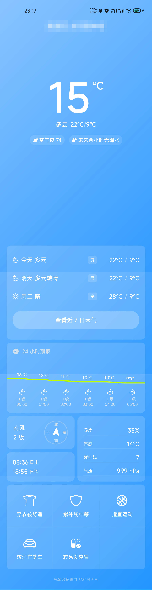
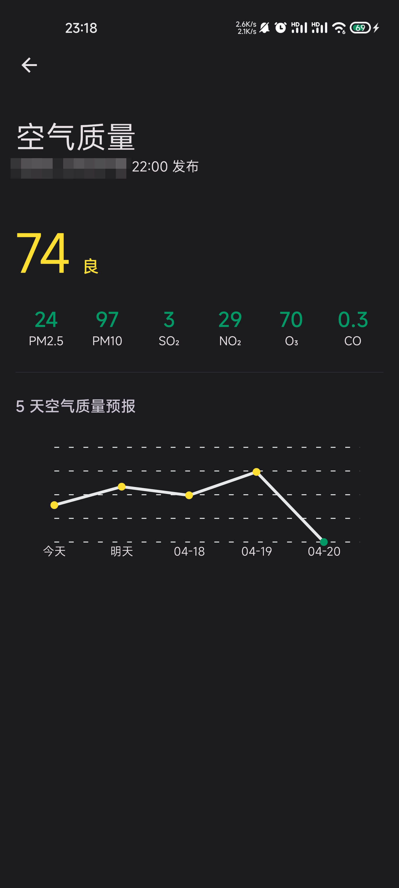
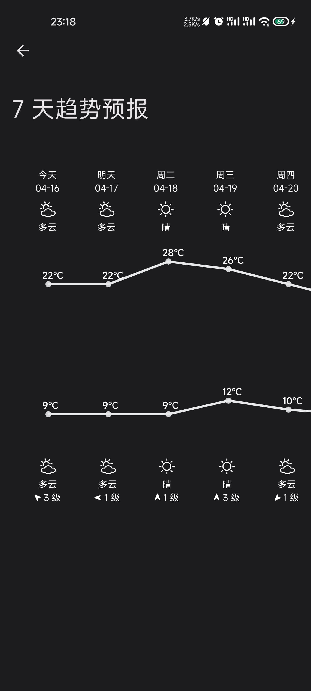

# RNWeather

## 这是什么？

基于 React Native 的天气 app，使用和风天气 API，界面上仿照 MIUI 14 的自带天气 app。纯粹是练手用。

尽管采用了跨端技术，但开发过程中并未在 iOS 上进行调试。如有需要请自行解决相关问题。

## 截图

## 如何使用

- 定位 API 使用百度地图，需要自行申请密钥并替换 `android/app/src/main/AndroidManifest.xml` 中的 `com.baidu.lbsapi.API_KEY` 和 `main/network/api-config.ts` 中的 `baiduGeolocationApiKey` 字段。
- 天气 API 使用和风天气，需要自行申请密钥并替换 `main/network/api-config.ts` 中的 `qWeatherApiKey` 字段。如果是付费版 API，还需要去掉 `qWeatherBaseUrl` 字段中主机名开头的 `dev`。

## 没有实现的

- 动态申请权限：React Native 有自带组件，但因为练手就没有考虑权限问题。需要手动授予定位权限。
- 未来 15 日天气和空气质量：和风天气免费版 API 不支持。
- 加载占位、多城市、数据缓存、动态背景、日出日落图：练手项目暂时不考虑。
- 其他：总之哪儿不对了就是因为练手项目不想搞。

## 后续

大概没有后续了。尝试了 React Native 之后让我更加坚定了以后还是使用平台原生技术开发 app 的想法。

